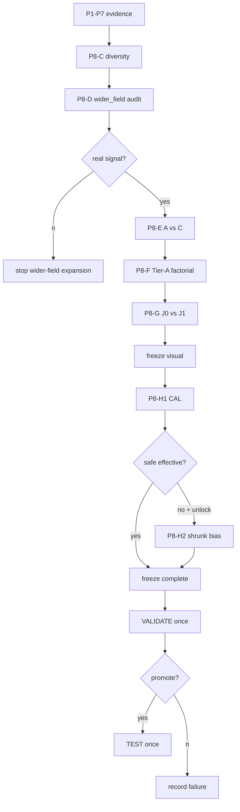
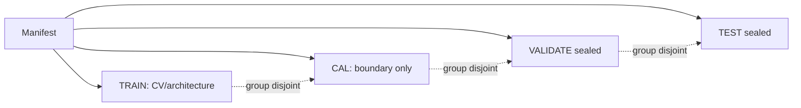
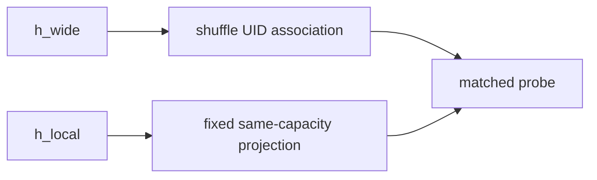
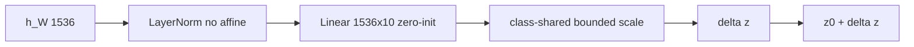
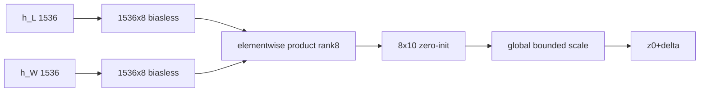
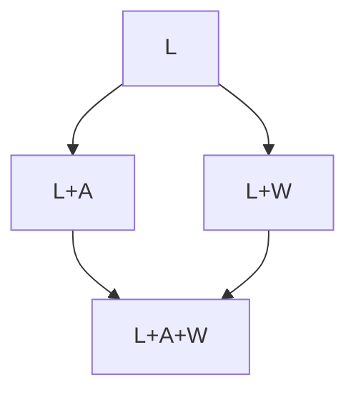
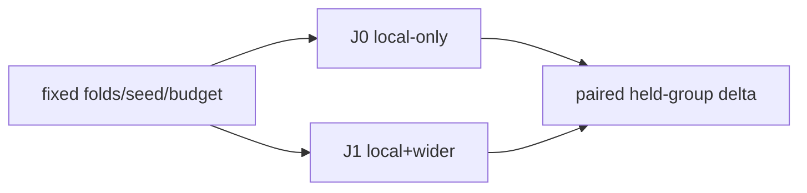
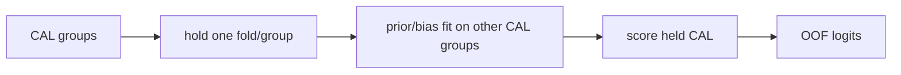

# Exploration 8: diversity, wider field, and boundary optimization

## Executive summary
I began Exploration 8 with a useful local representation and a generalization problem that Explorations 1-7 had not resolved. Limited independent-group diversity was one plausible cause. Exploration 6 had retained frozen UNI2-h, Gaussian token pooling at σ=1.5, 16-D Tier-A and rank-8 A5. Exploration 7 then gave me evidence for group diversity, wider context and boundary correction, although the boundary changes harmed recall for several rare classes. I used those findings to limit this study: repeat diversity versus density, examine what FOV192 adds, compare only A and C routing, revisit Tier-A where needed, run a matched J0/J1 joint refit, and test H1 before considering H2.

## Evidence level
I completed the exploratory quick-benchmark sequence: revised support-aware P8-C, the exposure comparison, P8-D wider-field probes, P8-E routing, P8-F Tier-A controls, P8-G joint refit, P8-H boundary evaluation and one protected VALIDATE evaluation. The support-aware P8-C record contains 225 unique fits. The final candidate failed the validation efficacy gate, so I claimed no successful promotion and reported no TEST result. I keep the earlier build and preflight notes as design history; the measured results below describe the completed run and supersede the earlier preflight-only status.

## Benchmark contract
`NO VERIFIED COMPARABLE NUMERICAL SOTA TARGET`. PUMA Track 2 is an end-to-end nuclei/tissue challenge; conditional fixed-coordinate Stage-2 classification is not a 1:1 numerical leaderboard task. Historical P6 metrics remain context only.

## Architecture
Local: FOV96 → frozen UNI2-h 16×16 patch tokens → Gaussian σ1.5 → hL∈R1536. Tier-A is the exact 16-D RGB/H-proxy local biology vector fit-normalized on the corresponding TRAIN fold. A5 uses appearance Linear(1536,10), biasless projections 1536→8 and 16→8, Hadamard product and zero-initialized biasless 8→10 residual: 27,866 trainable parameters. In the protocol, I left the production wider-field representation undecided: P8-D was to determine whether Gaussian192/annular192 survived the scale-only and capacity/alignment controls, followed by a P8-E comparison of A and C only.

## Data architecture and small-data limits
I kept TRAIN/CAL/VALIDATE/TEST disjoint at the strongest verified grouping level. Where only ROI is known, I report `PATIENT-LEVEL INDEPENDENCE UNVERIFIED`. I use effective group support, rather than raw nucleus count alone, to judge how much architecture complexity and how strong a claim the data can support. The code reports raw count, unique groups, Kish effective groups, largest-group share and support status for each class and role.

### Prepared quick benchmark subset

I prepared `QUICK_BENCHMARK` to study execution speed and behavior before a full-data Exploration-8 study. It is exploratory and does not estimate natural class prevalence. I selected it using annotation counts and independent-ROI coverage without consulting model outcomes, and assigned whole ROIs to roles. Both primary and metastatic sources were retained, with 24 primary and 12 metastatic ROIs. I capped dominant classes deterministically at 30 nuclei per class per ROI so that tumor and lymphocyte examples would not use most of the cache budget.

The full PUMA source contains 97,193 nuclei in 205 ROIs. The quick benchmark uses 4,891 sampled nuclei in 36 ROIs: 3,215 nuclei/24 ROIs for TRAIN, 519/4 for CAL, 534/4 for VALIDATE, and 623/4 for TEST. It therefore retains 17.6% of source ROIs but only 5.0% of source nuclei. The selected 36 ROIs contain 17,817 raw annotations before capping; deterministic sampling removes 72.5% of those annotations. The portable copied package is approximately 187 MB and excludes the 20 GB context-ROI directory.

| Class | Sampled nuclei | Independent ROIs |
|---|---:|---:|
| tumor | 1,076 | 36 |
| lymphocyte | 925 | 35 |
| plasma_cell | 168 | 20 |
| histiocyte | 668 | 27 |
| melanophage | 157 | 22 |
| neutrophil | 175 | 17 |
| stroma | 614 | 33 |
| epithelium | 418 | 16 |
| endothelium | 358 | 27 |
| apoptosis | 332 | 26 |

All ten classes are present in every role. TRAIN has at least 12 independent ROIs per class and supports five-fold grouped CV; after any one fold is held out, at least eight positive TRAIN ROIs per class remain. I initially treated those group counts as enough to establish P8-C feasibility. That was incorrect because I had not checked nucleus capacity within the selected groups. I describe the corrected support-aware design below. Since patient/case/slide metadata were not verified, the grouping remains ROI-based and the claim is `PATIENT-LEVEL INDEPENDENCE UNVERIFIED`. This enriched subset is neither a natural-prevalence sample nor a fresh confirmatory cohort.

### Relationship to Exploration 6 and Exploration 7 data

The quick benchmark is not the same experiment dataset used by Explorations 6 or 7, even where source ROIs overlap. Exploration 6 audited the complete 97,193-nucleus/205-ROI census, while its D900 modeling design used 900 TRAIN, 225 DEV, and 225 confirmation nuclei (1,350 total) distributed across 181 ROIs. Exploration 7's `EXPLORATORY_D900` preserves that 1,350-nucleus/181-ROI design. Exploration 7's separate public-PUMA exploratory cohort contains 26,518 nuclei across 49 ROIs.

All 36 quick-benchmark ROIs appear somewhere in the broader D900 181-ROI pool, but only 242 exact nucleus UIDs overlap. Compared with Exploration 7's 49-ROI public exploratory cohort, 22 of the 36 quick ROIs and 2,918 exact nucleus UIDs overlap. The sampling rules and role assignments differ in both cases. I therefore use the archived Exploration 6 and 7 metrics as historical context, not as controlled head-to-head comparisons. A fair comparison must evaluate the old baseline and the new Exploration 8 variants on the same manifest, frozen folds, seeds, coordinate contract, and fixed-ten metric. TRAIN grouped cross-validation should guide exploratory architecture comparisons; CAL, VALIDATE, and TEST must stay closed during design.

## P8-C through P8-H results

The original P8-C Colab run completed 114 model fits, but checking its roster generation exposed a feasibility problem. With frozen fold hash `8cb024eb001ec7b7d3ccdbe4d9faa8c6fe75f32753c6869d89e08e1ca0cd1b75`, local reproduction found 0/25 feasible div_low rosters, 7/25 div_high, 24/25 density_low and 7/25 density_high. I therefore excluded that diversity contrast as non-estimable despite the completed execution. I did not independently recheck the Colab performance values locally. I subsequently completed the revised support-aware run and downstream P8-D-H sequence; their saved outcomes are reported below.

### Support-aware P8-C amendment

I replaced the universal quotas with a plan calculated separately for each class from annotation counts in the frozen TRAIN training portions. Neither held-role counts nor model scores from CAL/VALIDATE/TEST entered that choice. Since I had already viewed the original outcomes, I treated this as a support-based exploratory amendment, not a new preregistered experiment, and superseded the original implementation.

The original targets remain 2 versus up to 8 groups and up to 40 unique nuclei per class. For each class, the matched count is capped by the minimum capacity of its richest two groups across training portions. Diversity requires at least 20 nuclei and more high than low groups; 20 is an explicit exploratory policy threshold, not a performance-selected optimum. Unsupported classes use a common feasible quota and identical UIDs across all four arms within each draw/fold. Density is manipulated only for diversity-eligible classes.

| Classes | Diversity groups | Matched nuclei/class | Density low → high |
|---|---|---:|---:|
| tumor, lymphocyte, histiocyte, stroma, epithelium, endothelium, apoptosis | 2 → 8 | 40 | 20 → 40 |
| melanophage | 2 → 8 | 29 | 14 → 29 |
| neutrophil | 2 → 8 | 27 | 13 → 27 |
| plasma_cell | fixed at 8 | 27 | fixed at 27 |

For group selection, I used random sequential choices constrained by whether the remaining capacity could still fill the quota. This does not sample feasible combinations uniformly. The low-diversity groups are included in the high-diversity set, and every selected group contributes at least one nucleus. I therefore interpret the comparison conditional on capacity-feasible low-diversity groups. It cannot estimate an unrestricted random-ROI effect or isolate a diversity effect for plasma cells. Conditioning on capacity and choosing additional groups remain limitations of the comparison.

I kept the group set fixed in the density comparison and nested the low-density nucleus roster inside the high-density roster. When div_high and density_high used an identical fold/seed/roster, I trained that reference once and reused it. All arms received 363 optimization draws per epoch with the existing inverse-class sampler, optimizer and model seeds. This matched the compute budgets without implying that every unique nucleus was visited in an epoch.

Before cache loading or model fitting, all 100 planned rosters must pass unique-UID, training-membership, exact count, group coverage, fixed-class identity and nested-density checks. A failure aborts the run. The plan records manifest, fold, protocol, configuration and roster-implementation hashes; individual roster hashes are persisted. Reusing an output directory with a different plan or completed results is rejected.

The local CPU preflight passed all 100 rosters. I also checked reproducibility after row reordering, held-out ROI exclusion, equality of shared references, and rejection of foreign UIDs and missing classes. The revised model artifacts record paired F1 and recall differences by fold, draw and model seed. I keep that model-performance evidence separate from the local roster preflight, and I do not count repeats sharing folds as independent biological replicates when assessing uncertainty.

The notebook's existing `SCENARIO = "p8c"` now runs this design and writes to `P8C_SUPPORT_AWARE`. The manifest, caches and frozen folds remain compatible. Operational commands are in the quick benchmark guide.

## VALIDATE / TEST
I opened VALIDATE once after freezing the pipeline. The candidate scored 0.358717 on primary ROI fixed-ten macro-F1, below the baseline's 0.363957, and failed efficacy. The artifacts contain neither a TEST opening marker nor a measured TEST result. The notebook's default flags and one-shot safeguards describe how opening is controlled; they do not imply that VALIDATE was never opened. I retained the baseline and kept the unsuccessful frozen candidate in the experimental record.

## Human review
I had no completed Exploration-8 blinded pathology review to analyze. The historical Exploration-7 review fields were also empty, so label ambiguity remained an unresolved supporting question.

## Runtime engineering
I organized cache building around one resident UNI2 model, loaded at most once per process. Each FOV192 token forward supplies both Gaussian192 and annular192 before I discard the tokens. The code decodes each ROI once per grouped block and reuses its channels for Tier-A features at all points. It stores compact N×1536 arrays with UID/meta sidecars. I did not replace missing target-GPU throughput measurements with estimates.

## Negative-evidence ledger
I kept LoRA, attention/gating branches, generic fusion MLPs, an architecture zoo, ensembling, stacked imbalance-loss combinations, per-class threshold tuning and an eleventh reject class outside this study. I still treated the P7 aggregate boundary gains as directional evidence. Their accompanying class harm was the reason to restrict boundary flexibility in Exploration-8.

## Limitations
Several limits remained after the experiments: fresh patient/case grouping might be unavailable, label ambiguity was unresolved, and full Stage-1 end-to-end effects were uncertified. Benchmark comparability was limited, and repeated selection on historical development data increased research-selection risk. I also lacked authoritative historical V17 source bytes in the build runtime, so I described the evaluator as a reconstruction of the contract rather than claiming byte-identical provenance.

## Pre-release implementation-parity corrections
Before observing outcomes, I audited implementation parity and corrected three parts of the code. I restored continuous coordinate-aware Gaussian pooling and the exact historical Tier-A Laplacian behavior, made TRAIN/CAL comparisons use frozen hashed folds, and added the conditional Tier-A shuffle/capacity controls. Amendments 001-003 document these implementation/specification corrections; they were not chosen in response to model results.

## Architecture matrix

I used this matrix to define the planned role of each component. The completed experimental record below gives the choices actually executed and the failed protected-validation outcome.

| ID | Purpose | Inputs | Extra trainable form | Status |
|---|---|---|---|---|
| Local A5 | rebuilt anchor | hL1536 + Tier-A16 | appearance 1536→10 + rank8 product residual | mandatory fresh P8 baseline |
| Wider G | mechanism | FOV192 tokens | none; Gaussian pool | audit candidate |
| Wider R | environment mechanism | FOV192 tokens | none; central-excluded pool | audit candidate |
| Scale | target-scale control | FOV96 pixels only | none | control |
| Route A | production route | selected hW | 1536→10 + one global scale | candidate |
| Route C | conditional route | hL,hW | 1536→8 × 1536→8 →10 + one global scale | candidate |
| H1 | boundary | frozen logits | one scalar λ | first boundary rung |
| H2 | boundary | H1 logits | strongly-shrunk zero-sum class bias | conditional only |

No LoRA, ensemble, generic MLP, attention/gating branch, per-class scale, per-class threshold, or eleventh reject class is present.

## Exploration-8 flowchart master

## 1. Research decision tree


## 2. Four-role partition


## 3. Group-aware inner CV


## 4. Local FOV96 extraction


## 5. Wider FOV192 extraction


## 6. Gaussian192


## 7. Annular192


## 8. Scale-only control


## 9. Capacity/shuffle controls


## 10. Candidate A


## 11. Candidate C


## 12. Tier-A factorial


## 13. Matched joint refit


## 14. Diversity exposure


## 15. CAL cross-fitting


## 16. H1 scalar prior


## 17. Conditional H2


## 18. VALIDATE one-shot


## 19. TEST one-shot


## 20. Runtime cache DAG


## 21. Notebook DAG
```mermaid
flowchart TD
A[config]-->B[preflight]-->C[stage/cache]-->D[P8C]-->E[P8D]-->F[P8E]-->G[P8F]-->H[P8G]-->I[visual freeze]-->J[P8H]-->K[complete freeze]-->L[optional VALIDATE]-->M[optional TEST]
```

## 22. Fail-closed path
```mermaid
flowchart TD
A[input/config]-->B{valid?}
B--no-->X[raise actionable error; no silent omission]
B--yes-->C{cache compatible?}
C--no-->Y[rebuild/reject]
C--yes-->D[continue]
```

## 23. Gradient boundary
```mermaid
flowchart LR
RGB[raw RGB]-.no grad.->U[UNI2 frozen]-.stop.->H[cached 1536]
H-->HEAD[trainable heads]
HEAD-->LOSS[CE]
LOSS-.grad only head.->HEAD
```

## Data-flow and component contracts

| Component | Input → Output | Trainable | Gradients | Cache | Fail closed |
|---|---|---:|---|---|---|
| crop96 | ROI RGB,x,y → 96×96 RGB | no | stop | no | center outside ROI |
| crop192 | ROI RGB,x,y → 192×192 RGB | no | stop | no | center outside ROI |
| scale-only | FOV96 pixels → centered 112×112 on white 224 canvas | no | stop | no | any outer biological pixel introduced |
| UNI2-h | normalized B×3×224×224 → token grid B×16×16×1536 | frozen | none | no full tokens by default | checkpoint shape mismatch |
| Gaussian pool | token grid → B×1536 | no | stop | yes | wrong grid shape |
| annular pool | FOV192 token grid → B×1536 excluding central-half footprint | no | stop | yes | geometry mismatch |
| Tier-A | ROI RGB+points → N×16 | no | stop | yes | empty disk/ring |
| fold normalizer | TRAIN-fold Tier-A → μ,σ and standardized rows | no | stop | metadata | any non-TRAIN fit row |
| A5 | hL,b → N×10 | yes, 27,866 | head only | checkpoint | wrong dims/class order |
| Route A | hW → Δz N×10 + one global bounded scale | yes | route only | checkpoint | per-class scale present |
| Route C | hL,hW → rank8 product → Δz N×10 + one global bounded scale | yes | route only | checkpoint | rank sweep/shape mismatch |
| boundary H1 | frozen logits + λd → logits | CAL scalar only | n/a | json | held CAL group used in its prior fit |
| boundary H2 | H1 logits + zero-sum shrunk δ | conditional | n/a | json | unlock artifact absent |

All compact caches contain UID order, manifest hash, encoder hash, representation definition, dtype/shape and data hash. Alignment is by UID, never positional assumption across independently produced caches.

### Coordinate-aware pooling invariant
All spatial pooling uses the verified historical coordinate convention: `left=floor(x-FOV/2+0.5)`, `top=floor(y-FOV/2+0.5)`, `u=(x-left)/(FOV/16)`, `v=(y-top)/(FOV/16)`. Gaussian weights are centered on continuous `(u,v)` over integer spatial-token index coordinates; no implicit half-token shift is permitted. For FOV192 annular pooling, the excluded central square is the FOV96 footprint around `(u,v)` (half-width 4 token-index units). Although center-excluded tokens are pooled, UNI2 tokens are globally contextualized by self-attention, so this representation is an environment-suppression diagnostic rather than proof of perfectly isolated outer tissue.

## Detailed pseudocode and adversarial design review

## P8-D pseudocode
1. Load each ROI once. 2. Extract paired FOV96/FOV192 and FOV96-derived scale-only input. 3. Run one resident UNI2-h; for each FOV192 forward derive Gaussian192 and annular192 from the same 16×16 token grid. 4. Persist pooled 1536-D arrays only. 5. With fixed grouped TRAIN folds, fit the same low-capacity probe for local+G, local+R and local+scale-only; run shuffle and same-capacity controls. 6. Interpret only incremental held-group evidence.

## Scientific architect
I retained A5 as the local anchor because Exploration 6 had established it, while P7 had shown incremental information in the wider field. A simple residual provided a small mechanism for using that information. I allowed only one conditional alternative, the rank-8 local×wide interaction, to test whether the value of context depended on target appearance.

## Small-data limitations
I based feasibility and rare-class safety on positive independent groups, not raw nucleus count. I excluded attention/gating/MLP branches, rank sweeps, class-specific scales and threshold tuning. When the data could not support a safety conclusion, I reported that lack of power rather than calling the model safe.

## Runtime constraints
I concentrated the runtime work on UNI2 inference and ROI I/O because those were the expensive parts of the pipeline. The code reuses ROI decoding and Tier-A channels, obtains two pooled views from one FOV192 token forward, and memory-maps the compact arrays. I kept confirmatory precision at FP32 unless a measured parity study justified a change.

## Hyperparameter and systems optimization
Scientific search is intentionally bounded to TRAIN grouped CV. Eligible knobs: common head/joint-refit LR, WD, effective batch, a tiny scheduler family only if justified, early-stop patience/min-delta, and the single residual-scale specification. Candidate count and selection pressure must be logged; one common config is used across seeds. H1 λ and conditional H2 shrinkage belong to CAL, not TRAIN HPO.

I treated extraction batch, workers, pinning/prefetch, mmap strategy, CPU threads and local staging as systems choices to benchmark while preserving semantics. Cold and warm timings were separated. Mixed precision/TF32/compile remained disabled in confirmatory mode until parity could be shown. At the build stage, I had run only package-level CPU smoke checks; target-GPU measurements were still `NOT EXECUTED`, so I did not estimate them.

## Preregistered Exploration-8 protocol
I used `00_PROTOCOL.json` as the machine-readable authority. A scientific change made after seeing a stage outcome required an amendment recording the old/new hashes and a downgrade of confirmation status.

TRAIN alone determines folds, diversity/density conclusions, P8-D/E/F/G architecture, sampler and visual weights. CAL is inaccessible until visual freeze and is used only for priors, H1/H2 and optional scalar temperature. VALIDATE opens once after complete freeze. TEST opens once only after a recorded `PROMOTE_TO_TEST` decision. Seeds 17/29/43 are robustness repeats, never an ensemble and never individually tuned.

The default local anchor is freshly initialized Exploration-8 A5: Gaussian 96 1536-D frozen UNI2 feature, fold-normalized Tier-A16, appearance Linear(1536,10), biasless 1536→8 and 16→8 projections, elementwise product, zero-initialized biasless 8→10 residual. Expected trainable parameters: 27,866. UNI2-h is always frozen and LoRA is prohibited.

I required a C-over-A advantage to be paired at the held biological-group level and larger than ordinary repeated-baseline variability. Without that evidence, I would keep A for simplicity; I did not add a post-hoc `0.003` cutoff. H2 would remain locked unless H1 improved the aggregate while harm was localized, CAL support was sufficient, and leakage or representation failure was not implicated.

## Protocol amendment 001: before real Exploration-8 outcomes
Exploration-8 raw-artifact provenance verified that the historical P7 wider-field probe used TRAIN-standardized multinomial logistic regression (`C=1`, `lbfgs`, `max_iter=600`) and identified its global pre-fold shuffle as a control weakness. Before any real Exploration-8 P8-D outcome was viewed, `40_P8D_WIDER_FIELD_AUDIT.json` was amended to the compatible fixed probe; shuffle and ROI-swap controls are now generated independently inside each TRAIN/held fold. Machine-readable lineage is `001_P8D_PROBE_PARITY.json`.

### Protocol amendment 002: pre-outcome implementation-parity correction
Before any real Exploration-8 outcome was viewed, a source/spec audit found three implementation gaps. First, the historical P6 Gaussian is coordinate-aware: for each crop, `left=floor(x-FOV/2+0.5)`, `u=(x-left)/(FOV/16)` (and analogously for `v`), with no half-token shift. Exploration-8 now uses that continuous coordinate for Gaussian 96, Gaussian192, annular192, and the scale-only control. Second, every P8-C through P8-G runner consumes the hashed P8-B TRAIN-fold artifact instead of regenerating a split. CAL H1/H2 likewise consumes the frozen CAL-fold artifact. Third, P8-F now includes train-row-shuffled Tier-A and a fixed label-free appearance-derived 16-D matched-capacity placebo conditional on W. Machine-readable lineage: `002_COORDINATE_FOLD_TIERA_PARITY.json`. No real Exploration-8 outcomes had been observed, so confirmatory status is preserved.

## Runtime and speed architecture
The cold path is `external immutable inputs → integrity/path preflight → optional /content staging → one resident UNI2-h → ROI-aware paired crops → compact pooled caches → GPU-resident small-head experiments`. The warm path begins from validated memory-mapped caches and never reloads UNI2.

Expected compact cache size per representation is `N × 1536 × 4` bytes in FP32 (≈6 KiB/nucleus). Four 1536-D representations therefore require ≈24 KiB/nucleus plus Tier-A/metadata; full 16×16×1536 token caching would be ≈1.5 MiB/nucleus and is prohibited by default. Real wall-clock throughput was not benchmarked in this build because the target GPU and UNI2 weights are absent. `SYSTEMS_BENCHMARK.json` records this explicitly.

DataLoader workers, pinning, prefetch, extraction batch, local staging and CPU threads are SYSTEMS parameters and must be benchmarked on the actual Colab GPU. LR/WD/batch/scheduler/early stop are SCIENTIFIC parameters and may be selected only by bounded TRAIN grouped-CV search. Class order, evaluator semantics, frozen split roles, FOV geometry after stage freeze, Stage-1 outputs, and UNI2 weights are FIXED-CONTRACT.

## Small-data feasibility
Before P8-C through P8-H and before VALIDATE, run `analyze_group_support.py`. Each class receives `ESTIMABLE`, `ESTIMABLE_WITH_LIMITED_SAFETY_POWER`, `UNDERPOWERED_FOR_CLASS_SPECIFIC_CLAIM`, or `NOT_ESTIMABLE`. Kish effective group count, largest-group share, median/max nuclei per group and unique groups are reported. If the strongest verified field is ROI, the required statement is `PATIENT-LEVEL INDEPENDENCE UNVERIFIED`.

At the initial design stage, I could not calculate class-specific feasibility because I had no fresh four-role manifest. The later quick-benchmark manifest provided the measured support by role reported above. I kept the historical ROI counts separate rather than relabeling them as new VALIDATE/TEST support.

## SOTA benchmark contract
Exploration-8 conditional Stage-2 classification is not 1:1 numerically comparable to the PUMA Track-2 leaderboard, which evaluates a complete challenge submission including nuclei detection/segmentation and tissue segmentation. The PUMA challenge describes Track 2 as ten-class nuclei segmentation plus tissue segmentation, and the final challenge ranking combines nuclei and tissue metrics. The verified final Track-2 winner table reports nuclei Macro-F1 0.2707 for NiTo, but that number is an end-to-end nuclei metric, not a fixed-coordinate conditional-classifier target.

Historical P6 locked-natural ROI fixed-10 macro-F1 is 0.157786 under the local study contract. Exploration-8 may compare against a freshly retrained matched local baseline under its own roles, not against the old task checkpoint. Current decision: `NO VERIFIED COMPARABLE NUMERICAL SOTA TARGET`.

External sources verified during build: official PUMA challenge evaluation/ranking pages and the GigaScience PUMA dataset paper. See `LITERATURE_PRIMARY_SOURCES.md`.

## Cache and runtime contract
Cache keys include authoritative manifest SHA256, UNI2 SHA256, representation name, FOV, pooling geometry, dtype, shape and code-contract string. Transient staged paths never define sample identity. UID arrays are stored beside numeric arrays and checked before merge. Full token grids are transient and not persisted by default. FOV192 Gaussian and annular are derived from the same encoder token forward.

## Metrics and gates
Primary confirmatory metric is exact local-V17/PUMA ROI fixed-10 Macro-F1 only when the evaluator contract and proposal population make it valid. Always pair it with semantic fixed-10/support-aware Macro-F1, balanced accuracy, accuracy, per-class precision/recall/F1/AUPRC, true/predicted counts, FP burden, NLL/ECE, confusion and group-wise deltas. AUPRC is preferred to AUROC for rare one-vs-rest discrimination.

VALIDATE primary efficacy uses paired biological-group effect and preregistered meaningful magnitude; safety blocks catastrophic supported-class recall harm (current config: drop ≥0.30). Unsupported classes produce `RARE-CLASS SAFETY NOT ESTABLISHED`, not a safety pass. TEST opens only after promotion.

## Primary literature and benchmark sources used in Exploration-8 design
- PUMA dataset paper, GigaScience, “A novel dataset for nuclei and tissue segmentation in melanoma…”: establishes the ten Track-2 nuclei classes, separate tissue task, cross-validation/test structure, and task mismatch with a fixed-coordinate conditional classifier.
- Official PUMA Grand Challenge overview/evaluation/winner pages: Track 2 requires ten-class nuclei output and tissue segmentation; final rankings report nuclei and tissue metrics together. This is why the leaderboard number is not treated as a 1:1 Stage-2 classifier target.
- Kang et al., “Decoupling Representation and Classifier for Long-Tailed Recognition” (ICLR / arXiv:1910.09217): motivates separating representation from boundary/classifier effects. Exploration-8 uses this as conceptual support only; P7 rare-class harm prevents blindly adopting cRT.
- Menon et al., “Long-tail learning via logit adjustment” (ICLR / arXiv:2007.07314): motivates principled prior/logit offsets. Exploration-8 restricts the degree of freedom to scalar λ first and estimates target priors by CAL group cross-fitting.
- UNI/UNI2 official release/model definition: frozen pathology foundation representation. Exploration-8 does not infer cell-level superiority from foundation-model benchmark breadth and does not adapt the encoder.

I used the cited methods where their assumptions matched the observed P6/P7 failure. I did not use a literature result to reopen LoRA or expand the architecture search.

## Completed quick-benchmark experimental record

The exploratory TRAIN/CAL workflow selected inverse exposure, Gaussian192 wider features, route C and no Tier-A for the candidate. I froze its visual recipe at seed 17, 10 epochs, batch 64, learning rate 0.001 and weight decay 0.01. That selected a candidate for evaluation, not a promoted final model. After the protected comparison failed efficacy, I retained the matched baseline. The measurements below keep those decisions separate.

### P8-D: wider-field information, scale and alignment controls

[Results](../RESULTS/QUICK_BENCHMARK/P8D/P8D.json). The probe is TRAIN-fold-standardized multinomial logistic regression with C=1.0, lbfgs, max_iter=600 and seed 17. It uses frozen hashed TRAIN folds and the recorded exploration8-v2 cache contract. Wider-field mechanisms are compared with the local representation, a scale-only control, shuffled wider features, a local-feature capacity placebo and within-ROI swaps. These are pooled out-of-fold semantic metrics, not protected validation or end-to-end scores.

| Arm | Macro-F1 | Accuracy | NLL | ECE15 |
| --- | --- | --- | --- | --- |
| local_only | 0.545176 | 0.561120 | 2.592378 | 0.316113 |
| gaussian192 | 0.577149 | 0.602488 | 2.507112 | 0.302528 |
| annular192 | 0.560046 | 0.590047 | 2.676652 | 0.303562 |
| scale_only192 | 0.541625 | 0.567963 | 2.663614 | 0.314702 |
| shuffle | 0.527048 | 0.553344 | 2.651342 | 0.325230 |
| local_placebo | 0.543434 | 0.561120 | 2.861250 | 0.327449 |
| within_roi_swap | 0.548605 | 0.564541 | 2.521562 | 0.309746 |

#### local_only

| Class | GT support | Predicted | Precision | Recall | F1 |
| --- | --- | --- | --- | --- | --- |
| tumor | 716 | 735 | 0.661224 | 0.678771 | 0.669883 |
| lymphocyte | 623 | 671 | 0.622951 | 0.670947 | 0.646059 |
| plasma_cell | 64 | 48 | 0.750000 | 0.562500 | 0.642857 |
| histiocyte | 450 | 462 | 0.400433 | 0.411111 | 0.405702 |
| melanophage | 115 | 109 | 0.706422 | 0.669565 | 0.687500 |
| neutrophil | 99 | 116 | 0.482759 | 0.565657 | 0.520930 |
| stroma | 437 | 436 | 0.525229 | 0.524027 | 0.524628 |
| epithelium | 298 | 272 | 0.551471 | 0.503356 | 0.526316 |
| endothelium | 241 | 223 | 0.511211 | 0.473029 | 0.491379 |
| apoptosis | 172 | 143 | 0.370629 | 0.308140 | 0.336508 |

#### gaussian192

| Class | GT support | Predicted | Precision | Recall | F1 |
| --- | --- | --- | --- | --- | --- |
| tumor | 716 | 741 | 0.731444 | 0.756983 | 0.743995 |
| lymphocyte | 623 | 631 | 0.645008 | 0.653291 | 0.649123 |
| plasma_cell | 64 | 65 | 0.584615 | 0.593750 | 0.589147 |
| histiocyte | 450 | 454 | 0.436123 | 0.440000 | 0.438053 |
| melanophage | 115 | 117 | 0.658120 | 0.669565 | 0.663793 |
| neutrophil | 99 | 131 | 0.480916 | 0.636364 | 0.547826 |
| stroma | 437 | 438 | 0.522831 | 0.524027 | 0.523429 |
| epithelium | 298 | 262 | 0.740458 | 0.651007 | 0.692857 |
| endothelium | 241 | 208 | 0.634615 | 0.547718 | 0.587973 |
| apoptosis | 172 | 168 | 0.339286 | 0.331395 | 0.335294 |

#### annular192

| Class | GT support | Predicted | Precision | Recall | F1 |
| --- | --- | --- | --- | --- | --- |
| tumor | 716 | 732 | 0.730874 | 0.747207 | 0.738950 |
| lymphocyte | 623 | 664 | 0.623494 | 0.664526 | 0.643357 |
| plasma_cell | 64 | 60 | 0.566667 | 0.531250 | 0.548387 |
| histiocyte | 450 | 493 | 0.417850 | 0.457778 | 0.436903 |
| melanophage | 115 | 103 | 0.718447 | 0.643478 | 0.678899 |
| neutrophil | 99 | 131 | 0.427481 | 0.565657 | 0.486957 |
| stroma | 437 | 406 | 0.514778 | 0.478261 | 0.495848 |
| epithelium | 298 | 258 | 0.751938 | 0.651007 | 0.697842 |
| endothelium | 241 | 199 | 0.582915 | 0.481328 | 0.527273 |
| apoptosis | 172 | 169 | 0.349112 | 0.343023 | 0.346041 |

#### scale_only192

| Class | GT support | Predicted | Precision | Recall | F1 |
| --- | --- | --- | --- | --- | --- |
| tumor | 716 | 729 | 0.706447 | 0.719274 | 0.712803 |
| lymphocyte | 623 | 660 | 0.637879 | 0.675762 | 0.656274 |
| plasma_cell | 64 | 63 | 0.619048 | 0.609375 | 0.614173 |
| histiocyte | 450 | 454 | 0.409692 | 0.413333 | 0.411504 |
| melanophage | 115 | 128 | 0.625000 | 0.695652 | 0.658436 |
| neutrophil | 99 | 118 | 0.491525 | 0.585859 | 0.534562 |
| stroma | 437 | 423 | 0.494090 | 0.478261 | 0.486047 |
| epithelium | 298 | 268 | 0.585821 | 0.526846 | 0.554770 |
| endothelium | 241 | 231 | 0.484848 | 0.464730 | 0.474576 |
| apoptosis | 172 | 141 | 0.347518 | 0.284884 | 0.313099 |

#### shuffle

| Class | GT support | Predicted | Precision | Recall | F1 |
| --- | --- | --- | --- | --- | --- |
| tumor | 716 | 749 | 0.676903 | 0.708101 | 0.692150 |
| lymphocyte | 623 | 679 | 0.603829 | 0.658106 | 0.629800 |
| plasma_cell | 64 | 60 | 0.633333 | 0.593750 | 0.612903 |
| histiocyte | 450 | 435 | 0.383908 | 0.371111 | 0.377401 |
| melanophage | 115 | 106 | 0.669811 | 0.617391 | 0.642534 |
| neutrophil | 99 | 102 | 0.490196 | 0.505051 | 0.497512 |
| stroma | 437 | 458 | 0.502183 | 0.526316 | 0.513966 |
| epithelium | 298 | 253 | 0.608696 | 0.516779 | 0.558984 |
| endothelium | 241 | 216 | 0.486111 | 0.435685 | 0.459519 |
| apoptosis | 172 | 157 | 0.299363 | 0.273256 | 0.285714 |

#### local_placebo

| Class | GT support | Predicted | Precision | Recall | F1 |
| --- | --- | --- | --- | --- | --- |
| tumor | 716 | 729 | 0.666667 | 0.678771 | 0.672664 |
| lymphocyte | 623 | 670 | 0.620896 | 0.667737 | 0.643465 |
| plasma_cell | 64 | 50 | 0.720000 | 0.562500 | 0.631579 |
| histiocyte | 450 | 453 | 0.408389 | 0.411111 | 0.409745 |
| melanophage | 115 | 114 | 0.692982 | 0.686957 | 0.689956 |
| neutrophil | 99 | 118 | 0.474576 | 0.565657 | 0.516129 |
| stroma | 437 | 433 | 0.526559 | 0.521739 | 0.524138 |
| epithelium | 298 | 274 | 0.554745 | 0.510067 | 0.531469 |
| endothelium | 241 | 226 | 0.500000 | 0.468880 | 0.483940 |
| apoptosis | 172 | 148 | 0.358108 | 0.308140 | 0.331250 |

#### within_roi_swap

| Class | GT support | Predicted | Precision | Recall | F1 |
| --- | --- | --- | --- | --- | --- |
| tumor | 716 | 769 | 0.659298 | 0.708101 | 0.682828 |
| lymphocyte | 623 | 640 | 0.621875 | 0.638844 | 0.630245 |
| plasma_cell | 64 | 56 | 0.714286 | 0.625000 | 0.666667 |
| histiocyte | 450 | 440 | 0.411364 | 0.402222 | 0.406742 |
| melanophage | 115 | 112 | 0.651786 | 0.634783 | 0.643172 |
| neutrophil | 99 | 108 | 0.472222 | 0.515152 | 0.492754 |
| stroma | 437 | 413 | 0.518160 | 0.489703 | 0.503529 |
| epithelium | 298 | 269 | 0.635688 | 0.573826 | 0.603175 |
| endothelium | 241 | 227 | 0.515419 | 0.485477 | 0.500000 |
| apoptosis | 172 | 181 | 0.348066 | 0.366279 | 0.356941 |

Gaussian192 improved on the local-only probe in aggregate, and neither the scale-only nor placebo arms reproduced the full gain. I interpreted that as evidence for useful wider-field information beyond added capacity or altered target scale. It did not identify a particular tissue cue. The class gains varied, so I checked the full class table rather than assume that every identity benefited. Annular and within-ROI controls test different explanations; a partial effect surviving one control does not show that local alignment is irrelevant.

### P8C_SUPPORT_AWARE: every executed arm

[Results](../RESULTS/QUICK_BENCHMARK/P8C_SUPPORT_AWARE/P8C_RESULTS.json). The artifact records per-fit macro-F1 and ten-class recall, but not per-class precision, F1, predicted counts or support for each fit. Only recorded class recall is aggregated here; missing precision/F1 are not inferred. Means are arithmetic means over the recorded fold/seed/draw entries and are not independent-patient estimates. In P8-C, shared identical high-arm fits are reused, so the number of result entries is not the number of unique fits.

| Arm | Recorded entries | Mean macro-F1 | Minimum | Maximum |
| --- | --- | --- | --- | --- |
| density_high | 75 | 0.473465 | 0.382641 | 0.530440 |
| density_low | 75 | 0.454017 | 0.368475 | 0.573648 |
| div_high | 75 | 0.473465 | 0.382641 | 0.530440 |
| div_low | 75 | 0.392570 | 0.245898 | 0.466402 |

#### density_high: class recall distribution

| Class | Mean recall | Minimum recall | Maximum recall |
| --- | --- | --- | --- |
| tumor | 0.540485 | 0.258333 | 0.808219 |
| lymphocyte | 0.525189 | 0.292453 | 0.852632 |
| plasma_cell | 0.570673 | 0.000000 | 1.000000 |
| histiocyte | 0.373445 | 0.125000 | 0.714286 |
| melanophage | 0.743831 | 0.454545 | 1.000000 |
| neutrophil | 0.523990 | 0.000000 | 1.000000 |
| stroma | 0.412155 | 0.225225 | 0.687500 |
| epithelium | 0.650761 | 0.192308 | 0.921053 |
| endothelium | 0.622254 | 0.301587 | 0.838710 |
| apoptosis | 0.359188 | 0.000000 | 0.666667 |

#### density_low: class recall distribution

| Class | Mean recall | Minimum recall | Maximum recall |
| --- | --- | --- | --- |
| tumor | 0.508923 | 0.260000 | 0.766667 |
| lymphocyte | 0.506802 | 0.258333 | 0.789474 |
| plasma_cell | 0.605286 | 0.000000 | 1.000000 |
| histiocyte | 0.357960 | 0.104348 | 0.670330 |
| melanophage | 0.712917 | 0.375000 | 1.000000 |
| neutrophil | 0.492802 | 0.000000 | 1.000000 |
| stroma | 0.406172 | 0.222222 | 0.637681 |
| epithelium | 0.603445 | 0.179487 | 0.947368 |
| endothelium | 0.629625 | 0.206349 | 0.884615 |
| apoptosis | 0.328489 | 0.000000 | 0.621622 |

#### div_high: class recall distribution

| Class | Mean recall | Minimum recall | Maximum recall |
| --- | --- | --- | --- |
| tumor | 0.540485 | 0.258333 | 0.808219 |
| lymphocyte | 0.525189 | 0.292453 | 0.852632 |
| plasma_cell | 0.570673 | 0.000000 | 1.000000 |
| histiocyte | 0.373445 | 0.125000 | 0.714286 |
| melanophage | 0.743831 | 0.454545 | 1.000000 |
| neutrophil | 0.523990 | 0.000000 | 1.000000 |
| stroma | 0.412155 | 0.225225 | 0.687500 |
| epithelium | 0.650761 | 0.192308 | 0.921053 |
| endothelium | 0.622254 | 0.301587 | 0.838710 |
| apoptosis | 0.359188 | 0.000000 | 0.666667 |

#### div_low: class recall distribution

| Class | Mean recall | Minimum recall | Maximum recall |
| --- | --- | --- | --- |
| tumor | 0.431667 | 0.194444 | 0.700000 |
| lymphocyte | 0.372435 | 0.086667 | 0.633333 |
| plasma_cell | 0.620842 | 0.000000 | 1.000000 |
| histiocyte | 0.268761 | 0.031250 | 0.604167 |
| melanophage | 0.648446 | 0.187500 | 1.000000 |
| neutrophil | 0.472724 | 0.000000 | 0.944444 |
| stroma | 0.329513 | 0.086420 | 0.593750 |
| epithelium | 0.533786 | 0.094340 | 0.944444 |
| endothelium | 0.570317 | 0.289474 | 0.838710 |
| apoptosis | 0.355813 | 0.000000 | 0.675676 |

#### Paired diversity and density changes

I interpret these repeats as checks of stability under the recorded sampling and initialization scheme. They share folds and nuclei, so they are not independent biological replicates. Plasma-cell quotas were fixed across arms; any change in plasma-cell recall is therefore an indirect effect of changing the other classes, not a direct manipulation of plasma-cell diversity.
##### diversity class-recall change

| Class | Mean Δ recall | Minimum | Maximum |
| --- | --- | --- | --- |
| tumor | 0.108818 | -0.280000 | 0.426667 |
| lymphocyte | 0.152754 | -0.116667 | 0.593333 |
| plasma_cell | -0.050168 | -0.272727 | 0.090909 |
| histiocyte | 0.104684 | -0.177083 | 0.483516 |
| melanophage | 0.095386 | -0.187500 | 0.625000 |
| neutrophil | 0.051266 | -0.400000 | 1.000000 |
| stroma | 0.082642 | -0.270833 | 0.370370 |
| epithelium | 0.116974 | -0.346154 | 0.735849 |
| endothelium | 0.051937 | -0.307692 | 0.365385 |
| apoptosis | 0.003375 | -0.405405 | 0.500000 |

##### density class-recall change

| Class | Mean Δ recall | Minimum | Maximum |
| --- | --- | --- | --- |
| tumor | 0.031561 | -0.258333 | 0.216667 |
| lymphocyte | 0.018386 | -0.296053 | 0.225000 |
| plasma_cell | -0.034613 | -0.250000 | 0.250000 |
| histiocyte | 0.015485 | -0.243478 | 0.260417 |
| melanophage | 0.030914 | -0.142857 | 0.312500 |
| neutrophil | 0.031188 | -0.200000 | 0.600000 |
| stroma | 0.005983 | -0.239583 | 0.234568 |
| epithelium | 0.047316 | -0.153846 | 0.320513 |
| endothelium | -0.007371 | -0.174603 | 0.396825 |
| apoptosis | 0.030699 | -0.310811 | 0.222222 |


| Contrast | Pairs | Mean Δ macro-F1 | Positive pairs | Minimum | Maximum |
| --- | --- | --- | --- | --- | --- |
| diversity | 75 | 0.080894 | 72 | -0.034385 | 0.203699 |
| density | 75 | 0.019448 | 58 | -0.073130 | 0.087357 |

### P8C_EXPOSURE: every executed arm

[Results](../RESULTS/QUICK_BENCHMARK/P8C_EXPOSURE/P8C_EXPOSURE_RESULTS.json). The artifact records per-fit macro-F1 and ten-class recall, but not per-class precision, F1, predicted counts or support for each fit. Only recorded class recall is aggregated here; missing precision/F1 are not inferred. Means are arithmetic means over the recorded fold/seed/draw entries and are not independent-patient estimates. In P8-C, shared identical high-arm fits are reused, so the number of result entries is not the number of unique fits.

| Arm | Recorded entries | Mean macro-F1 | Minimum | Maximum |
| --- | --- | --- | --- | --- |
| group | 15 | 0.519303 | 0.465082 | 0.542692 |
| inverse | 15 | 0.521768 | 0.474267 | 0.556431 |

#### group: class recall distribution

| Class | Mean recall | Minimum recall | Maximum recall |
| --- | --- | --- | --- |
| tumor | 0.674433 | 0.538889 | 0.856164 |
| lymphocyte | 0.640691 | 0.443396 | 0.789474 |
| plasma_cell | 0.470370 | 0.000000 | 0.750000 |
| histiocyte | 0.455042 | 0.343750 | 0.604396 |
| melanophage | 0.684059 | 0.437500 | 0.956522 |
| neutrophil | 0.452617 | 0.000000 | 0.954545 |
| stroma | 0.565920 | 0.487500 | 0.710145 |
| epithelium | 0.555381 | 0.179487 | 0.830189 |
| endothelium | 0.517890 | 0.342105 | 0.774194 |
| apoptosis | 0.368173 | 0.111111 | 0.666667 |

#### inverse: class recall distribution

| Class | Mean recall | Minimum recall | Maximum recall |
| --- | --- | --- | --- |
| tumor | 0.677952 | 0.520000 | 0.842466 |
| lymphocyte | 0.661638 | 0.471698 | 0.809211 |
| plasma_cell | 0.475926 | 0.000000 | 0.750000 |
| histiocyte | 0.418324 | 0.250000 | 0.541667 |
| melanophage | 0.687369 | 0.375000 | 0.869565 |
| neutrophil | 0.421603 | 0.000000 | 0.772727 |
| stroma | 0.512924 | 0.387500 | 0.652174 |
| epithelium | 0.586895 | 0.243590 | 0.849057 |
| endothelium | 0.529495 | 0.342105 | 0.741935 |
| apoptosis | 0.433388 | 0.222222 | 0.750000 |

### P8E: every executed arm

[Results](../RESULTS/QUICK_BENCHMARK/P8E/P8E_RESULTS.json). The artifact records per-fit macro-F1 and ten-class recall, but not per-class precision, F1, predicted counts or support for each fit. Only recorded class recall is aggregated here; missing precision/F1 are not inferred. Means are arithmetic means over the recorded fold/seed/draw entries and are not independent-patient estimates. In P8-C, shared identical high-arm fits are reused, so the number of result entries is not the number of unique fits.

| Arm | Recorded entries | Mean macro-F1 | Minimum | Maximum |
| --- | --- | --- | --- | --- |
| A | 15 | 0.544764 | 0.497425 | 0.590837 |
| C | 15 | 0.552736 | 0.502872 | 0.594156 |

#### A: class recall distribution

| Class | Mean recall | Minimum recall | Maximum recall |
| --- | --- | --- | --- |
| tumor | 0.737456 | 0.626667 | 0.863014 |
| lymphocyte | 0.668603 | 0.415094 | 0.800000 |
| plasma_cell | 0.430976 | 0.000000 | 0.750000 |
| histiocyte | 0.479299 | 0.343750 | 0.583333 |
| melanophage | 0.626503 | 0.375000 | 0.869565 |
| neutrophil | 0.452857 | 0.000000 | 0.818182 |
| stroma | 0.559201 | 0.412500 | 0.724638 |
| epithelium | 0.622153 | 0.205128 | 0.846154 |
| endothelium | 0.539099 | 0.394737 | 0.741935 |
| apoptosis | 0.380561 | 0.111111 | 0.666667 |

#### C: class recall distribution

| Class | Mean recall | Minimum recall | Maximum recall |
| --- | --- | --- | --- |
| tumor | 0.748073 | 0.606667 | 0.863014 |
| lymphocyte | 0.662426 | 0.433962 | 0.773333 |
| plasma_cell | 0.478283 | 0.000000 | 0.750000 |
| histiocyte | 0.494936 | 0.387931 | 0.604167 |
| melanophage | 0.651528 | 0.375000 | 0.869565 |
| neutrophil | 0.424569 | 0.000000 | 0.818182 |
| stroma | 0.538238 | 0.375000 | 0.710145 |
| epithelium | 0.664474 | 0.230769 | 0.923077 |
| endothelium | 0.543565 | 0.394737 | 0.774194 |
| apoptosis | 0.407513 | 0.222222 | 0.750000 |

### P8F: every executed arm

[Results](../RESULTS/QUICK_BENCHMARK/P8F/P8F_RESULTS.json). The artifact records per-fit macro-F1 and ten-class recall, but not per-class precision, F1, predicted counts or support for each fit. Only recorded class recall is aggregated here; missing precision/F1 are not inferred. Means are arithmetic means over the recorded fold/seed/draw entries and are not independent-patient estimates. In P8-C, shared identical high-arm fits are reused, so the number of result entries is not the number of unique fits.

| Arm | Recorded entries | Mean macro-F1 | Minimum | Maximum |
| --- | --- | --- | --- | --- |
| L / real | 15 | 0.527516 | 0.495922 | 0.563692 |
| L+A / real | 15 | 0.521768 | 0.474267 | 0.556431 |
| L+A+W / real | 15 | 0.560480 | 0.506386 | 0.604250 |
| L+A+W_APPEARANCE_PLACEBO / matched_capacity_label_free | 15 | 0.558882 | 0.518058 | 0.601098 |
| L+A+W_SHUFFLED_TIERA / shuffle_train_only | 15 | 0.555652 | 0.521187 | 0.591997 |
| L+W / real | 15 | 0.557885 | 0.507061 | 0.623829 |

#### L / real: class recall distribution

| Class | Mean recall | Minimum recall | Maximum recall |
| --- | --- | --- | --- |
| tumor | 0.692978 | 0.533333 | 0.835616 |
| lymphocyte | 0.631208 | 0.367925 | 0.789474 |
| plasma_cell | 0.525926 | 0.000000 | 1.000000 |
| histiocyte | 0.434192 | 0.343750 | 0.552083 |
| melanophage | 0.694780 | 0.375000 | 1.000000 |
| neutrophil | 0.448961 | 0.000000 | 0.722222 |
| stroma | 0.527980 | 0.362500 | 0.666667 |
| epithelium | 0.614967 | 0.217949 | 0.849057 |
| endothelium | 0.554877 | 0.289474 | 0.806452 |
| apoptosis | 0.404484 | 0.111111 | 0.750000 |

#### L+A / real: class recall distribution

| Class | Mean recall | Minimum recall | Maximum recall |
| --- | --- | --- | --- |
| tumor | 0.677952 | 0.520000 | 0.842466 |
| lymphocyte | 0.661638 | 0.471698 | 0.809211 |
| plasma_cell | 0.475926 | 0.000000 | 0.750000 |
| histiocyte | 0.418324 | 0.250000 | 0.541667 |
| melanophage | 0.687369 | 0.375000 | 0.869565 |
| neutrophil | 0.421603 | 0.000000 | 0.772727 |
| stroma | 0.512924 | 0.387500 | 0.652174 |
| epithelium | 0.586895 | 0.243590 | 0.849057 |
| endothelium | 0.529495 | 0.342105 | 0.741935 |
| apoptosis | 0.433388 | 0.222222 | 0.750000 |

#### L+A+W / real: class recall distribution

| Class | Mean recall | Minimum recall | Maximum recall |
| --- | --- | --- | --- |
| tumor | 0.769802 | 0.686667 | 0.863014 |
| lymphocyte | 0.675699 | 0.452830 | 0.802632 |
| plasma_cell | 0.450337 | 0.000000 | 1.000000 |
| histiocyte | 0.509256 | 0.353448 | 0.718750 |
| melanophage | 0.655810 | 0.375000 | 0.913043 |
| neutrophil | 0.458303 | 0.000000 | 0.863636 |
| stroma | 0.531495 | 0.360360 | 0.710145 |
| epithelium | 0.682203 | 0.205128 | 0.948718 |
| endothelium | 0.552595 | 0.442308 | 0.774194 |
| apoptosis | 0.381276 | 0.000000 | 0.750000 |

#### L+A+W_APPEARANCE_PLACEBO / matched_capacity_label_free: class recall distribution

| Class | Mean recall | Minimum recall | Maximum recall |
| --- | --- | --- | --- |
| tumor | 0.779381 | 0.638889 | 0.883562 |
| lymphocyte | 0.659762 | 0.377358 | 0.769737 |
| plasma_cell | 0.460943 | 0.000000 | 1.000000 |
| histiocyte | 0.499738 | 0.344828 | 0.656250 |
| melanophage | 0.658301 | 0.375000 | 0.956522 |
| neutrophil | 0.477904 | 0.000000 | 0.792453 |
| stroma | 0.551244 | 0.324324 | 0.724638 |
| epithelium | 0.683613 | 0.192308 | 0.924528 |
| endothelium | 0.569970 | 0.421053 | 0.806452 |
| apoptosis | 0.341802 | 0.000000 | 0.750000 |

#### L+A+W_SHUFFLED_TIERA / shuffle_train_only: class recall distribution

| Class | Mean recall | Minimum recall | Maximum recall |
| --- | --- | --- | --- |
| tumor | 0.777960 | 0.622222 | 0.890411 |
| lymphocyte | 0.632814 | 0.358491 | 0.802632 |
| plasma_cell | 0.523064 | 0.000000 | 1.000000 |
| histiocyte | 0.491132 | 0.318966 | 0.656250 |
| melanophage | 0.664625 | 0.375000 | 0.956522 |
| neutrophil | 0.442011 | 0.000000 | 0.792453 |
| stroma | 0.529021 | 0.225225 | 0.739130 |
| epithelium | 0.701173 | 0.166667 | 0.905660 |
| endothelium | 0.576434 | 0.368421 | 0.806452 |
| apoptosis | 0.336311 | 0.000000 | 0.666667 |

#### L+W / real: class recall distribution

| Class | Mean recall | Minimum recall | Maximum recall |
| --- | --- | --- | --- |
| tumor | 0.777320 | 0.627778 | 0.890411 |
| lymphocyte | 0.654649 | 0.330189 | 0.796053 |
| plasma_cell | 0.461785 | 0.000000 | 1.000000 |
| histiocyte | 0.508318 | 0.353448 | 0.637931 |
| melanophage | 0.647159 | 0.312500 | 0.956522 |
| neutrophil | 0.507213 | 0.000000 | 0.811321 |
| stroma | 0.549803 | 0.324324 | 0.739130 |
| epithelium | 0.690594 | 0.115385 | 0.897436 |
| endothelium | 0.573801 | 0.438596 | 0.806452 |
| apoptosis | 0.304780 | 0.000000 | 0.666667 |

### P8G: every executed arm

[Results](../RESULTS/QUICK_BENCHMARK/P8G/P8G_RESULTS.json). The artifact records per-fit macro-F1 and ten-class recall, but not per-class precision, F1, predicted counts or support for each fit. Only recorded class recall is aggregated here; missing precision/F1 are not inferred. Means are arithmetic means over the recorded fold/seed/draw entries and are not independent-patient estimates. In P8-C, shared identical high-arm fits are reused, so the number of result entries is not the number of unique fits.

| Arm | Recorded entries | Mean macro-F1 | Minimum | Maximum |
| --- | --- | --- | --- | --- |
| J0 | 15 | 0.527516 | 0.495922 | 0.563692 |
| J1 | 15 | 0.557885 | 0.507061 | 0.623829 |

#### J0: class recall distribution

| Class | Mean recall | Minimum recall | Maximum recall |
| --- | --- | --- | --- |
| tumor | 0.692978 | 0.533333 | 0.835616 |
| lymphocyte | 0.631208 | 0.367925 | 0.789474 |
| plasma_cell | 0.525926 | 0.000000 | 1.000000 |
| histiocyte | 0.434192 | 0.343750 | 0.552083 |
| melanophage | 0.694780 | 0.375000 | 1.000000 |
| neutrophil | 0.448961 | 0.000000 | 0.722222 |
| stroma | 0.527980 | 0.362500 | 0.666667 |
| epithelium | 0.614967 | 0.217949 | 0.849057 |
| endothelium | 0.554877 | 0.289474 | 0.806452 |
| apoptosis | 0.404484 | 0.111111 | 0.750000 |

#### J1: class recall distribution

| Class | Mean recall | Minimum recall | Maximum recall |
| --- | --- | --- | --- |
| tumor | 0.777320 | 0.627778 | 0.890411 |
| lymphocyte | 0.654649 | 0.330189 | 0.796053 |
| plasma_cell | 0.461785 | 0.000000 | 1.000000 |
| histiocyte | 0.508318 | 0.353448 | 0.637931 |
| melanophage | 0.647159 | 0.312500 | 0.956522 |
| neutrophil | 0.507213 | 0.000000 | 0.811321 |
| stroma | 0.549803 | 0.324324 | 0.739130 |
| epithelium | 0.690594 | 0.115385 | 0.897436 |
| endothelium | 0.573801 | 0.438596 | 0.806452 |
| apoptosis | 0.304780 | 0.000000 | 0.666667 |

### P8-H: boundary correction was tested and rejected

[Results](../RESULTS/QUICK_BENCHMARK/FINAL_CANDIDATE_seed17/P8H_BOUNDARY.json). Baseline CAL semantic macro-F1 was 0.652082; cross-fitted H1 reached 0.640081, a change of -0.012000. The final fitted lambda was 0.0. H2 remained locked because the required evidence and class support were not established. The selected boundary was H0_NO_BOUNDARY_CHANGE, with temperature 1.0.

#### Baseline CAL class metrics

| Class | GT support | Predicted | Precision | Recall | F1 |
| --- | --- | --- | --- | --- | --- |
| tumor | 120 | 105 | 0.761905 | 0.666667 | 0.711111 |
| lymphocyte | 92 | 119 | 0.596639 | 0.771739 | 0.672986 |
| plasma_cell | 29 | 21 | 0.904762 | 0.655172 | 0.760000 |
| histiocyte | 56 | 60 | 0.533333 | 0.571429 | 0.551724 |
| melanophage | 26 | 28 | 0.750000 | 0.807692 | 0.777778 |
| neutrophil | 9 | 7 | 0.428571 | 0.333333 | 0.375000 |
| stroma | 55 | 54 | 0.537037 | 0.527273 | 0.532110 |
| epithelium | 30 | 39 | 0.717949 | 0.933333 | 0.811594 |
| endothelium | 42 | 41 | 0.804878 | 0.785714 | 0.795181 |
| apoptosis | 60 | 45 | 0.622222 | 0.466667 | 0.533333 |

#### Cross-fitted H1 CAL class metrics

| Class | GT support | Predicted | Precision | Recall | F1 |
| --- | --- | --- | --- | --- | --- |
| tumor | 120 | 107 | 0.747664 | 0.666667 | 0.704846 |
| lymphocyte | 92 | 121 | 0.586777 | 0.771739 | 0.666667 |
| plasma_cell | 29 | 21 | 0.904762 | 0.655172 | 0.760000 |
| histiocyte | 56 | 60 | 0.533333 | 0.571429 | 0.551724 |
| melanophage | 26 | 27 | 0.740741 | 0.769231 | 0.754717 |
| neutrophil | 9 | 5 | 0.400000 | 0.222222 | 0.285714 |
| stroma | 55 | 53 | 0.547170 | 0.527273 | 0.537037 |
| epithelium | 30 | 39 | 0.717949 | 0.933333 | 0.811594 |
| endothelium | 42 | 41 | 0.804878 | 0.785714 | 0.795181 |
| apoptosis | 60 | 45 | 0.622222 | 0.466667 | 0.533333 |

The boundary result differed from the useful aggregate corrections in the earlier natural-prevalence cohort. Here, on enriched CAL, neutrophil recall fell by 0.111111 and cross-fitted F1 also fell. I therefore kept the recorded zero final lambda and left H2 locked. Those were decisions based on the experiment, not unfinished optimization. With only four CAL groups, several classes had weak effective support; the presence of at least one nucleus per class could not validate class-specific flexibility.

### Protected VALIDATE: frozen candidate against matched retained baseline

[Results](../RESULTS/QUICK_BENCHMARK/FINAL_CANDIDATE_seed17/VALIDATE_RESULT.json). The four-ROI validation population contains 534 nuclei. The comparison is GT-centered conditional classification. The candidate has primary ROI fixed-ten macro-F1 0.358717 versus 0.363957 for the baseline. The paired group effect is -0.005241 with interval [-0.038118, 0.039623]. Primary efficacy did not pass. The recorded decision is EXPLORATION_8_VALIDATION_FAILED_OR_INCONCLUSIVE.

#### baseline validation class metrics

| Class | GT support | Predicted | Precision | Recall | F1 |
| --- | --- | --- | --- | --- | --- |
| tumor | 120 | 83 | 0.867470 | 0.600000 | 0.709360 |
| lymphocyte | 90 | 134 | 0.492537 | 0.733333 | 0.589286 |
| plasma_cell | 39 | 37 | 0.675676 | 0.641026 | 0.657895 |
| histiocyte | 60 | 72 | 0.430556 | 0.516667 | 0.469697 |
| melanophage | 6 | 3 | 0.333333 | 0.166667 | 0.222222 |
| neutrophil | 37 | 31 | 0.741935 | 0.621622 | 0.676471 |
| stroma | 46 | 38 | 0.526316 | 0.434783 | 0.476190 |
| epithelium | 30 | 25 | 0.920000 | 0.766667 | 0.836364 |
| endothelium | 43 | 69 | 0.376812 | 0.604651 | 0.464286 |
| apoptosis | 63 | 42 | 0.571429 | 0.380952 | 0.457143 |

#### candidate validation class metrics

| Class | GT support | Predicted | Precision | Recall | F1 |
| --- | --- | --- | --- | --- | --- |
| tumor | 120 | 83 | 0.879518 | 0.608333 | 0.719212 |
| lymphocyte | 90 | 125 | 0.504000 | 0.700000 | 0.586047 |
| plasma_cell | 39 | 33 | 0.696970 | 0.589744 | 0.638889 |
| histiocyte | 60 | 77 | 0.415584 | 0.533333 | 0.467153 |
| melanophage | 6 | 2 | 0.500000 | 0.166667 | 0.250000 |
| neutrophil | 37 | 45 | 0.644444 | 0.783784 | 0.707317 |
| stroma | 46 | 28 | 0.571429 | 0.347826 | 0.432432 |
| epithelium | 30 | 24 | 0.791667 | 0.633333 | 0.703704 |
| endothelium | 43 | 68 | 0.470588 | 0.744186 | 0.576577 |
| apoptosis | 63 | 49 | 0.428571 | 0.333333 | 0.375000 |

#### Class recall changes and safety estimability

| Class | Δ recall candidate − baseline | Positive ROIs | Safety estimable |
| --- | --- | --- | --- |
| tumor | 0.008333 | 4 | True |
| lymphocyte | -0.033333 | 3 | True |
| plasma_cell | -0.051282 | 3 | True |
| histiocyte | 0.016667 | 2 | False |
| melanophage | 0.000000 | 2 | False |
| neutrophil | 0.162162 | 2 | False |
| stroma | -0.086957 | 4 | True |
| epithelium | -0.133333 | 1 | False |
| endothelium | 0.139535 | 4 | True |
| apoptosis | -0.047619 | 3 | True |

I saw gains in neutrophil and endothelium recall, but losses in stroma, epithelium and other classes. Epithelium recall fell by 0.133333 and had support in only one positive ROI. I recorded that harm without claiming that this cohort could establish population safety for the class. Passing the supported-class guard neither established all-class safety nor overrode failed primary efficacy. With only four groups, the paired interval was wide and crossed zero. I retained the baseline and kept TEST closed instead of retuning against VALIDATE.

### Final evidence boundary

The revised roster comparison was feasible and completed; I continued to exclude the original infeasible run. Wider-field and routing results supplied exploratory evidence, but the architecture favored during development did not demonstrate a protected validation gain. I could only propose mechanisms for the heterogeneous class effects: context may help tissue-dependent identities, while dilution, correlated ROI cues or unstable small-class boundaries may harm others. The controls narrowed these explanations without isolating one cause. I had no completed human pathology adjudication, verified patient-level independence or complete fixed Stage-1 proposal result, and reported no invented TEST performance.

## Integrated interpretation of the completed selection sequence

The support-aware diversity comparison raised mean semantic macro-F1 from 0.392570 to 0.473465; the density comparison raised it from 0.454017 to 0.473465. In this admitted design, spreading examples across more ROIs was more useful than only adding nuclei within the available groups. I keep that conclusion conditional on the roster construction: it selects for capacity, fixes plasma-cell treatment, and reuses folds and source ROIs. The 300 arm records share a high-arm reference and correspond to 225 unique fits, not an unrestricted estimate of the diversity effect.

I retained inverse exposure after the sampler comparison. Group-aware exposure reached mean macro-F1 0.519303 against 0.521768 for inverse exposure, which gave me no evidence for replacing the sampler in this screen. This did not contradict the diversity result. The sampler changes how often existing examples are revisited; changing the diversity roster changes which source examples are available.

Route C reached mean macro-F1 0.552736 against 0.544764 for route A. Its local/wider interaction is a plausible explanation for that advantage, but this experiment did not isolate the mechanism. I also had to account for optimism from architecture selection and repeated development comparisons. The class-recall distributions showed that the average gain did not extend uniformly to every identity.

The Tier-A factorial made me revisit a component that I had retained in earlier Explorations. Here L+A scored below L, 0.521768 versus 0.527516. With wider context, L+A+W scored 0.560480 against 0.557885 for L+W, but the matched-capacity appearance placebo reached 0.558882 and shuffled Tier-A reached 0.555652. I did not take the small real-Tier-A point gain alone as strong evidence for a specific biological correction beyond the expanded appearance representation. The saved workflow selected no Tier-A for this cohort; that contextual choice does not reverse the measured results in the earlier cohorts.

The matched joint refit reached mean macro-F1 0.557885 for J1 and 0.527516 for J0. I used that development gain to justify freezing a candidate for protected evaluation, not to replace that evaluation. H1 then lowered cross-fitted CAL macro-F1, so I kept the unmodified boundary. The candidate's protected primary ROI score was ultimately below the baseline's. In this quick benchmark, the development advantage did not transfer to validation. I would not infer that wider context contains no information: the component probes and complete pipeline answer different questions, in different evaluation roles and with different aggregation rules.
